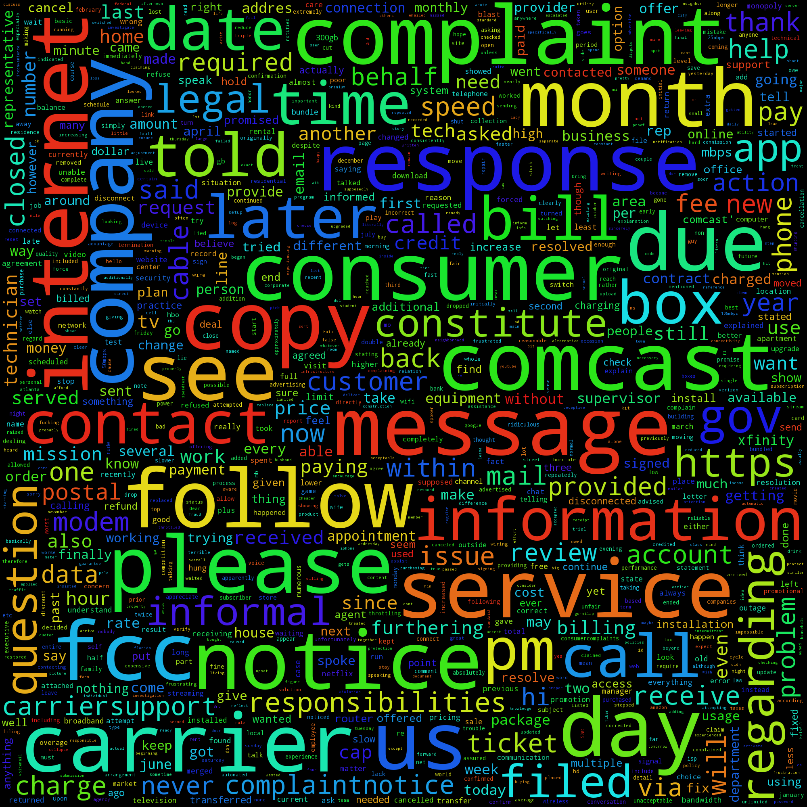

# Sentiment Analysis and Clustering of Comcast Customer Complaints

- word cloud from FCC complaints

### Overview

In this project, I was trying to conduct sentiment analysis on Comcast customer complaints. In specifically, I used text of customer complaints to predict the customer ratings. Additionally, I used unsupervised machine learning techniques to cluster customer complaints.

There are two datasets used. One is the Comcast customer complaints on consumeraffairs.com. This dataset contains following information:

* author - name and location of customers.
* posted_on - datetime of the posts.
* rating - customer ratings ranging from 1 to 5.
* text - the complaints.

The other dataset is the Comcast customer complaints on FCC website. Since there are no ratings on the website, I used this dataset to do unsupervised natural language processing. The dataset contains:

* Ticket Number
* Customer Complaints - the titles of the complaints.
* rating - customer ratings ranging from 1 to 5.
* Date
* Time
* Received Via - how the complaints were submitted.
* City
* State
* Zip code
* Status - is the case still open or not
* Filling on behalf of someone - yes / no
* Description - the actual complete text of complaints

---

### Challenges

The main challenges of this project are:

* Natural language processing
* Data cleaning
* Feature engineering
* Unsupervised learning on text data

---

### Methodology

In this project, I utilized TextBlob to lemmatize text, used NLTK to delete stopwords, used TfidfVectorizer to tokenize lemmas as features, and built a Xgboost model to make prediction. I also used K Means to cluster text data. Accuracy score and confusion matrix were used to evaluate model performance.
